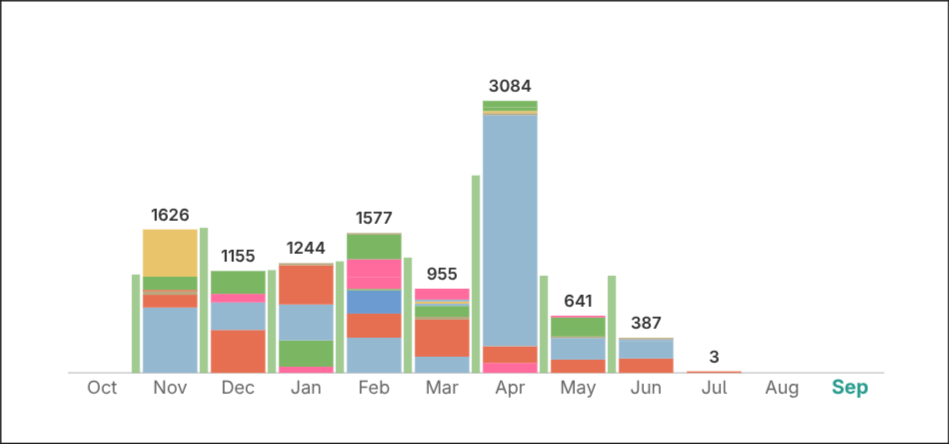
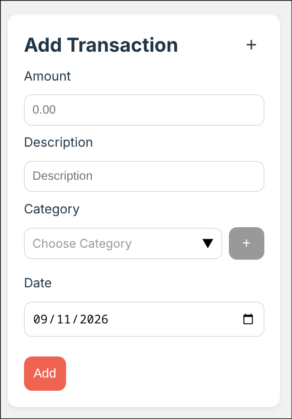
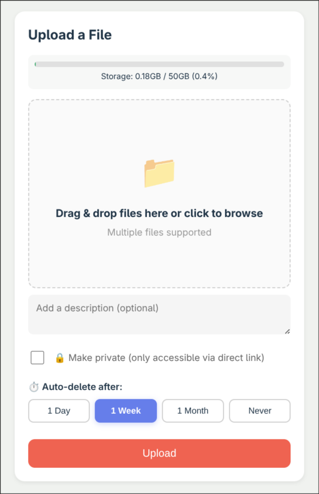

# Gian's Web Applications & Services 🚀

A modern full-stack web application monorepo featuring shared authentication, real-time sync, file sharing, and expense tracking deployed on a personal self-hosted cloud infrastructure.

---

## 🌐 Live Applications

| Application | URL | Repository | Description |
| :--- | :--- | :--- | :--- |
| **Main Portal** | [gian.ink](https://gian.ink) | [GianUwU/gian-main-website](https://github.com/GianUwU/gian-main-website) | Interactive portal and personal project showcase |
| **MTG Tabletop Sync** | [mtg.gian.ink](https://mtg.gian.ink) | [GianUwU/mtg-tabletop-sync](https://github.com/GianUwU/mtg-tabletop-sync) | Real-time tabletop match tracker with multi-device phone controls |
| **Finance Tracker** | [finance.gian.ink](https://finance.gian.ink) | [GianUwU/gian-main-website](https://github.com/GianUwU/gian-main-website) | Expense analytics, budget management & reporting |
| **Drop** | [drop.gian.ink](https://drop.gian.ink) | [GianUwU/gian-main-website](https://github.com/GianUwU/gian-main-website) | Self-hosted fast file sharing, drag & drop, clipboard paste & preview |

---

## 📸 Screenshots & Previews

### ⚔️ MTG Tabletop Sync
Real-time synchronized tabletop tracker for Magic: The Gathering matches.


---

### 💰 Finance Tracker
Personal finance management dashboard with monthly analytics, category breakdowns, and transaction history.



---

### 📁 Drop - Fast File Sharing
Self-hosted cloud storage with instant downloads, in-browser previews, and clipboard paste support.


---

## 🏗️ Monorepo Architecture

```
webserver/
├── NodeJsBackend/          # Node.js Express microservices & SQLite databases
│   ├── authServer.js       # Centralized authentication & JWT token management (Port 3000)
│   ├── financeServer.js    # Financial transactions & categories API (Port 3001)
│   ├── dropServer.js       # File upload, storage & raw streaming API (Port 3002)
│   ├── db.js               # Database initialization & migrations
│   └── Databases/          # Persistent SQLite databases
│
├── main-app/               # Main landing portal (React 19 + TypeScript + Vite)
├── finance-app/            # Finance tracker frontend (React 19 + TypeScript + Vite)
├── drop-app/               # File sharing frontend (React 19 + TypeScript + Vite)
├── flavia-app/             # Flavia application (React 19 + TypeScript + Vite)
│
├── ngnix_configs/          # Production reverse-proxy Nginx configurations with SSL
├── update_all.sh           # Automated container build and registry deployment pipeline
├── start-dev.sh            # Local development startup script
└── stop-dev.sh             # Local development shutdown script
```

---

## 🛠️ Technology Stack

- **Frontend**: React 19, TypeScript, Vite, CSS Grid & Flexbox, Vanilla CSS design system
- **Backend**: Node.js (Express), SQLite3, JWT (`jsonwebtoken`), bcrypt password hashing
- **Containerization**: Docker, Docker Compose, Multi-stage Alpine builds
- **Reverse Proxy & SSL**: Nginx, Let's Encrypt SSL/TLS, Rate Limiting

---

## 🔐 Security & Authentication

- **Centralized Auth**: Shared authentication across all services.
- **HttpOnly Cookies**: Secure cross-subdomain authentication using JWT access tokens (10-minute validity) paired with persistent refresh tokens (30-day validity).
- **Graceful Token Refresh**: Automatic in-flight token refresh with request retries upon token expiration.
- **Secure Password Hashing**: `bcrypt` with 10 salt rounds.

---

## 🚀 Getting Started

### Prerequisites
- Node.js 20+
- Docker & Docker Compose
- SQLite3

### 1. Local Development
To launch all backend microservices and Vite frontend servers locally:

```bash
# Start all services
./start-dev.sh

# Stop all services
./stop-dev.sh
```

**Local Ports:**
- Main Portal: `http://localhost:5173`
- Drop Portal: `http://localhost:5174`
- Finance Portal: `http://localhost:5175`
- Auth API: `http://localhost:3000`
- Finance API: `http://localhost:3001`
- Drop API: `http://localhost:3002`

---

### 2. Production Deployment

To build and deploy all container images to the Docker registry:

```bash
# Deploy all containers with image pushing
echo "y" | ./update_all.sh
```

---

## 👤 Author

**Gian Gaudenz**
- GitHub: [@GianUwU](https://github.com/GianUwU)
- Email: [gian@gaudi.ch](mailto:gian@gaudi.ch)
- Website: [gian.ink](https://gian.ink)
